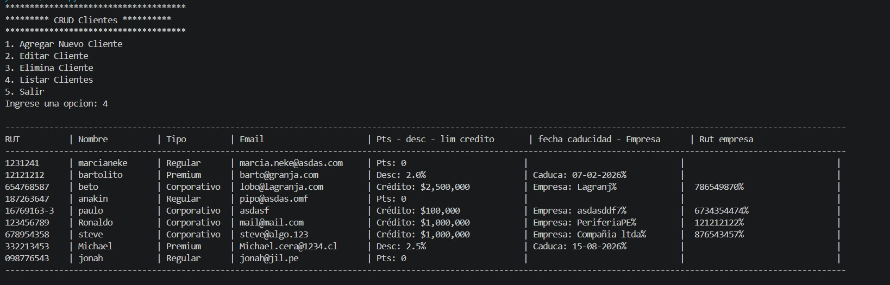
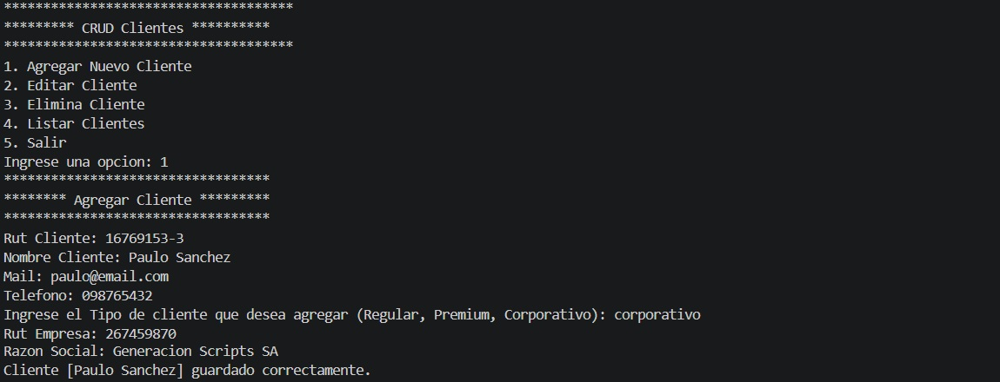
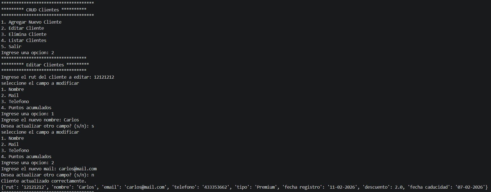

# 👥 CRUD Clientes

## 📌 Descripción
Aplicación en Python que permite realizar operaciones **CRUD (Crear, Leer, Actualizar y Eliminar)** sobre clientes.  
Es un ejemplo práctico de cómo gestionar datos de manera sencilla, utilizando programación orientada a objetos y menús interactivos.

## 🎯 Beneficio
- Facilita la administración de información de clientes.  
- Ejemplo claro de lógica CRUD aplicada en Python.  
- Base para sistemas más completos de gestión empresarial.

## 🖼️ Ejemplo visual
### Menú principal - Listado Clientes


### Registro de cliente


### Edicion de cliente


### Eliminacion de cliente


*(Las imágenes muestran cómo se ejecuta el programa en consola.)*

## ⚙️ Tecnologías
- Python 3  
- Programación orientada a objetos  
- Manejo de archivos  

## 📂 Cómo usar
1. Clonar el repositorio:  
   ```bash
   git clone https://github.com/Paulouc/CRUD-clientes.git
   cd CRUD-clientes
